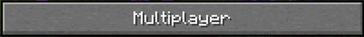
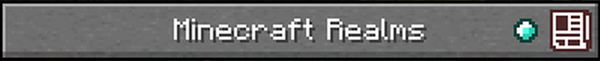
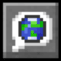
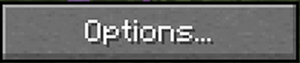
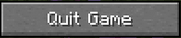
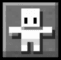

# Video Game Title Screen

## What are we doing?

In this project, we'll be rebuilding the Minecraft Java Edition (AKA: the better edition) title screen with actual Minecraft assets 


(May change image later) 


## Section 1: The Background and Title
To start off, we will be uploading one of Minecraft's title screen background images. (And, to make it easier for ourselves, it will already have the title on it)

Starting in 'index.html' we will be creating a division, or section, to "hold" our background image. With the `<div>` tag, we will be creating it with the class "bg" inside the body element.

Such should look like this:

```
<body>
  <div class="bg">
  </div>
</body>
```

With that done, we will now be going into `styles.css` to use 'bg' class to showcase our background image. Within this class, we will be using the following format to alter the class and add a background-image

We will be starting with this:
```
.bg {

    /* flex container for child elements (AKA: the buttons) */
    display: flex; 
    flex-direction: column;
    justify-content: center;
}
```

Note: The code already in there will be used later to create our buttons

To add our background, we will have to use the `background-image` property within the 'bg' class.

Once that is completed, you will find that the background looks off, sort of like this:


Unfortunately though, most players wouldn't be satisfied with seeing only half the title and background screen, which means more work for us. So, to this fix this, we will be using the following CSS properties:

`background-position:` 
This property determines the position of the background image.

For our title screen, it'd be ideal to use a property to <ins>**center**</ins> it on the screen.

`background-size:`
This property determines the size of the background image. 

To make sure the background image fits across the entire scene, we'd like to use a background-size property that <ins>**cover**</ins>s the entire screen.

`background-repeat:` 
This property determines if a background image should repeat over and over again across the screen. (This is more visible within images that are small) 

While our background image will likely not repeat, it would still be good to ensure it doesn't. Luckily, a property for <ins>**no-repeat**</ins>ing does exist.

With all those properties in place, we will be left with the following:


Answer: (Will remove once students see this, just here for my use)
```
/* the .bg refers to the 'bg' div in index.html*/
  .bg {
    /* The image used */
    background-image: url('minecraft-assets/minecraft_background_with_title.png');
  
    /* Full height */
    height: 100%;
  
    /* Center and scale the image nicely */
    background-position: center;
    background-size: cover;
    background-repeat: no-repeat;
  }
```

## Section 2: The Buttons
With our background and title now created, we will now be focusing on the creation of our buttons.

Starting off with 'index.html' again, we will be using the `<div>` HTML tag to create two new divisions with classes named "center_buttons" and "bottom_buttons" within the division with the class name "bg."

It should look something like this
```
<body>
  <div class="bg">
      <div class="center_buttons">
      </div>
      <div class="bottom_buttons">
      </div>
  </div>
</body>
```

Now that we have our divisions set up, we will now be inputting some images inside these divisions that represent our buttons, all inside 'index.html'

With the use of the `` HTML tag, we will be using the images within the 'minecraft-assets' folder to set up our button images. 

To help you out, one example of the use of the `` tag within our code will look like this:
```
  
```

The `` tag requires showing the path to the image we want to use, which happens to be in the minecraft-assets folder. In addition to that, the `` tag allows you have to alternative text, designated by: `alt="[text here]"` that will be shown if your picture doesn't show up. The use of the alt. text is useful, especially when debugging your code, as it shows up when the code itself works but the image itself is not showing up. 

With all that in mind, please place images under the proper division. 

The divisions should have the following images:

**Center Buttons:**

• Singleplayer Button

• Multiplayer Button

• Minecraft Realms Button

**Bottom Buttons:**

• Language Button

• Options Button

• Quit Button

• Accessibility Button

Note: For the title screen to look right, the images must be added in this order 

When you have completed all that, you will be left with a title screen that looks like this:


For a game that (seriously) costs $30, most players would expect a much cleaner and organized main menu screen, so let's fix this up!

In `styles.css` we will be styling the "center_buttons" class first. With that in mind, start by creating the selector:
```
.center_buttons {

}
```

Once that is done, then, inside the selector (or the curly braces), type ``display: flex;``. Such will tell our buttons that we'll be using the flexbox model to organize it. 

Since these buttons have spacing between them, you'll also want to use the ``gap`` property. Within the selector (or curly braces) also type ``gap: 10px;``

With that done, we will then have to use our knowledge of the flexbox model to <ins>**center**</ins> and place the buttons in a <ins>**column**</ins> format. 

Once you have figured that out, you should be left with a main menu screen that looks like this:


We're almost done! With that completed, we will now be doing the same thing for the "bottom_buttons." Create another selector using the bottom_buttons class. Also, like the center_buttons, you'll need to establish a flexbox model, a gap, and now a new property called ``margin-top.``

The following should look like this:
```
.bottom_buttons {
  display: flex; 
  gap: 10px; 
  margin-top: 40px;
}
```

With that all written, you must now consider what else about this flexbox model must be changed to <ins>**center**</ins> the buttons. 

And with that, we should have our final product, that being something like this!


## (Stretch Goal) Section 3: Animated Text
NOTE: This is optional! (I will be showing you something you have not learned yet) 


[Remove later]
HTML Answer:
<!DOCTYPE html>
<html lang="en">
<head>
    <link rel="stylesheet" href="styles.css">
    <title>Minecraft Main Menu</title>
  </head>
<body>
  <div class="bg">
    <div class="center_buttons">
      
      
      
      </div>
    <div class="bottom_buttons">
      
      
      
      
    </div>
  </div>
</body>
</html>

CSS Answer:
body, html {
    margin: 0;
    height: 100%; 
    display: flex; 
    flex-direction: column;
  }
  /* Leave the above on top*/
  
  /* the .bg refers to the 'bg' div in index.html*/
  .bg {
    background-image: url('minecraft-assets/minecraft_background_with_title.png');
    height: 100%;
    background-position: center;
    background-size: cover;
    background-repeat: no-repeat;  

    /* Flex container for child elements */
    display: flex; 
    flex-direction: column;
    justify-content: center;
  }

  .center_buttons {
    display: flex; 
    align-items: center;
    flex-direction: column;
    gap: 10px; 
}   

/* Note: align-items: row not needed for images automatically placed in a row */

.bottom_buttons {
  display: flex; 
  justify-content: center;
  gap: 10px; 
  margin-top: 40px;
}   

