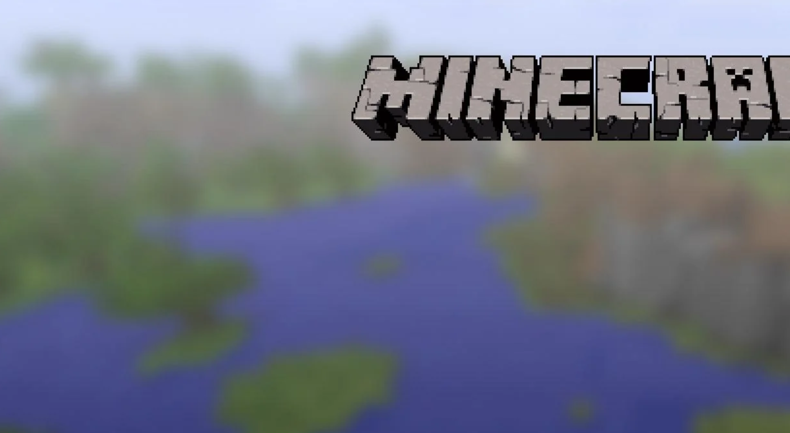
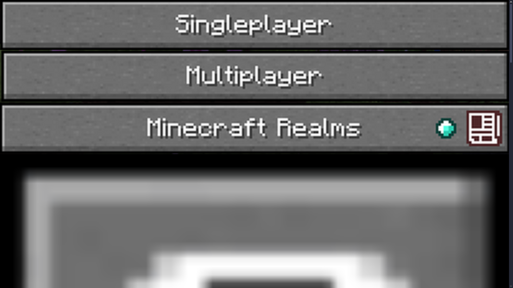
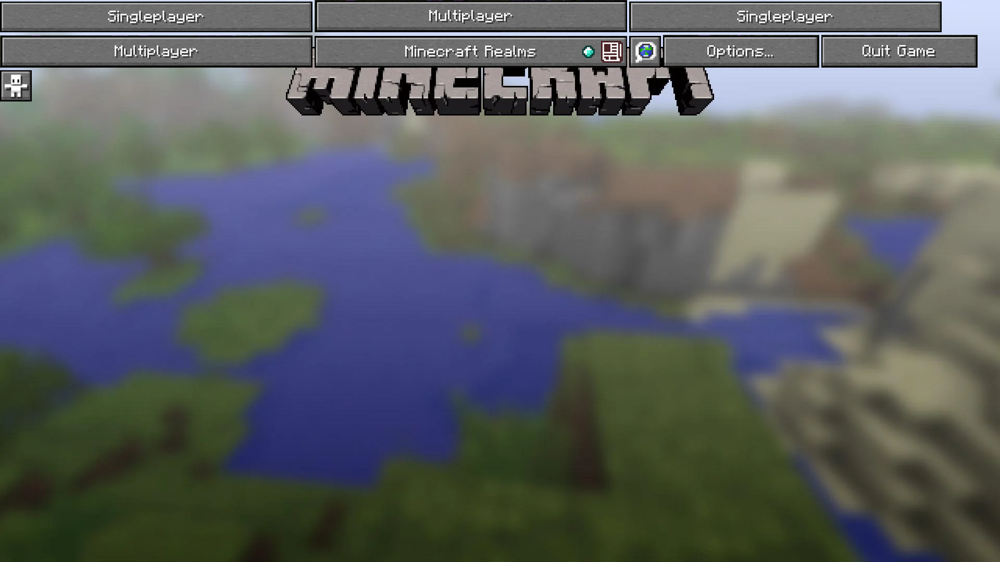
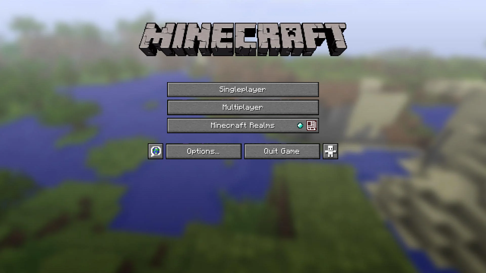
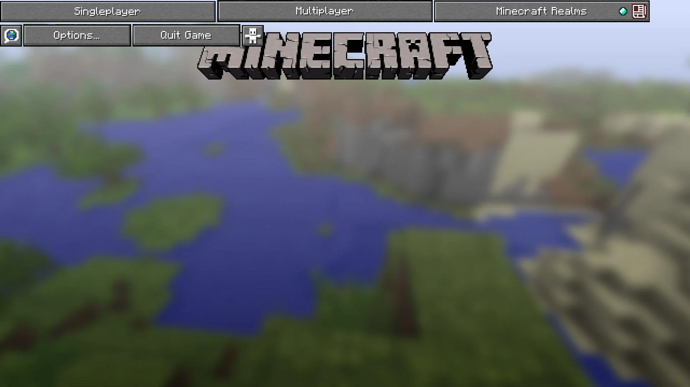
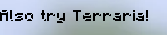
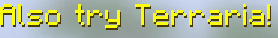

# Video Game Title Screen

## Table of Contents
1. [What are we doing?](#what-are-we-doing)
2. [Section 1: The Background and Title](#section-1-the-background-and-title)
3. [Section 2: The Buttons](#section-2-the-buttons)
4. [Section 3: Flexbox](#section-3-flexbox)
5. [(Stretch Goal) Section 4: Animated Text](#stretch-goal-section-4-animated-text)

## What are we doing?

In this project, we'll be rebuilding the Minecraft Java Edition (AKA: the better edition) title screen with actual Minecraft assets.


## Section 1: The Background and Title
To start off, we will be uploading one of Minecraft's title screen background images. (And, to make it easier for ourselves, it will already have the title on it.)

Head over to style.css and create a new line targeting the ```body``` element. We'll use the ```background-image``` property to add ```minecraft_background_with_title.png``` to it.

__*NOTE:*__ When using file paths in CSS, you have to put the file path inside a ```url``` tag, like this:

```
background-image: url("folder/image.png");
```

When we add this property to our HTML's body, we should get the background to look something like this:



There are a couple more useful background image properties to help perfect our website's background.

- ```background-position: center;```
  - This centers our image and makes it stay the same size no matter how big the window is.
- ```background-size: cover;```
  - This makes the image cover the entire screen.
- ```background-repeat: no-repeat;```
  - If our image is too small, it might repeat itself over and over again to fill up the page. This makes sure it doesn't repeat, so only one image will be part of the background.

## Section 2: The Buttons
With our background and title now created, we will now be focusing on the creation of our buttons.

Let's add the button images inside the ```body``` of our HTML. We'll use the ```img``` to add in order...

1. Singleplayer
2. Multiplayer
3. Realms
4. Language
5. Options
6. Quit
7. Accessibility

If we just add the images directly to the body, it looks...



like a game that wouldn't (seriously) cost $30.

In order to fix this, let's group all of our images into a divider! Create a ```div``` tag and put all of our images inside it.

```
<div>
    
    
    ...
    ...
</div>
```



Much better, although we want to make it look like this!



We need to do this by using **Flexbox!**

## Section 3: Flexbox

First of all, let's order the buttons from top to bottom. Using flexbox, we can target the divider that holds all the buttons, and ```flex-direction: column;``` should do the trick. First of all, let's give the ```div``` holding all our images the ID **"images"** so we can target it specifically.

```
<div id="images">
  
  
  ...
  ...
</div>
```

Now we can target it specifically in the CSS, by adding a ```#``` symbol before saying the ID. Let's give this div the ```display: flex;``` property first to activate flexbox on it, then give it the ```flex-direction``` property.

```
#images {
  display: flex;
  flex-direction: column;
}
```


Uh oh, now our buttons are too big again, so it's time to use dividers once more!

Looking at our reference again...


It looks like we can divide these buttons into two groups: The <u>top</u> and <u>bottom</u> buttons. Let's divide them by using two dividers, two ```div``` elements. Give the first div the ID <u>top</u>, and the second div the ID <u>bottom</u>.

Inside the top div, put these:
- Singleplayer
- Multiplayer
- Minecraft Realms

images in. Put the other four buttons in the bottom divider. Here's a hint on how it should look:
```
<div id="images">
    <div id="top">
      
      ...
      ...
    </div>
    <div id="bottom">
      
      ...
      ...
    </div>
</div>
```

We should be back to something normal again:



Now it's up to you to use Flexbox in order to position the buttons in the right places! You should use Flexbox with both the <u>top</u> and <u>bottom</u> dividers in order to accomplish this. Here are a few useful flexbox properties to help you out:

- ```display: flex;```
  - Enables Flexbox
- ```margin-top: 100px;```
  - Creates an invisible margin at the top, pushing your content downwards.
- ```margin-left: 100px;```
  - Creates an invisible margin at the left, pushing your content to the right.
- ```gap: 10px;```
  - Creates some space between each element in the divider.
- ```justify-content: center```
  - Centers the items horizontally.
- ```flex-direction: column;```
  - Lines up the items into a column, from up to down.
- ```align-items: center;```
  - Centers the items vertically. Can affect sizing.


## (Stretch Goal) Section 4: Animated Text
NOTE: This is optional! (I will be showing you something you have not learned yet) 

On the main menu of Minecraft you'll notice that flashing yellow text right by the title. Such text is called "splash text."

We'll recreate this by adding a ```p``` tag underneath our ```div``` with the ```images``` ID. Give this ```p``` element the ID ```splash```.

```
  <div id="images">
    <p id="splash">Also try Terraria!</p>
    <div id="top">
    ...
```

We're going to import the Minecraft font into our CSS. Paste this code into an empty area in your CSS to import it:

```
@font-face {
  font-family: 'minecraftregular';
  src: url('https://fonts.cdnfonts.com/s/25041/1_MinecraftRegular1.woff') format('woff');
}
```

The previous code is called the CSS @font-face rule. If you'd like to learn more, consider [this link](https://www.w3schools.com/cssref/atrule_font-face.php)

Next, target your ```p``` element using it's ID "splash" and change it's ```font-family``` to ```'minecraftregular'```. This should give our text the minecraft font:



**_NOTE:_** After typing the font family of your choosing, add a comma and write ```sans-serif```, which is another font. This will be a backup font in case the first font is unable to load.

With that now completed, we will now focus on the size of this font. In order to change the size of this text, we will now use `font-size` which is based on pixels. In this case, we will set the size of the font to **30 pixels**.
[More info on font-size here](https://developer.mozilla.org/en-US/docs/Web/CSS/font-size).

Next, change the color of the text to **hex** color code **#fafd11**.

Add a text shadow to the text by using the text shadow property. The `text-shadow` property can hold up to four values, as designated below:
```
text-shadow: offset-x, offset-y, blur-radius, color;
```

The offsets will adjust the position of the shadow horizontally (x) and vertically (y) while the blur-radius, adjusts how blurry the shadow is.  In our case though, we will not be using the blur-radius value, so we will not include that in our final code. 

All in all, these should be the properties of our splash text element:

```
font-family: 'minecraftregular', sans-serif;
font-size: 30px;
color: #fafd11;
text-shadow: 1px 2px #463903;
```



With that all completed, we will now be altering the position of the text. In order to do this, we will be using the following properties:

- `position`
- `top`
- `left`

Starting with the `position` property, which describes the position method type, we will be applying the **absolute** value. 

For more information on position property, consider looking at [this link](https://www.w3schools.com/cssref/pr_class_position.php).

By making the position of the text absolute, we will be able to place the text wherever we want on the screen without being affected by the other elements. (In other words, think of it like a **magnet on a fridge.** Even if there are sticky notes, pictures, or other magnets on the fridge, you can still freely place that magnet anywhere on that fridge without it being pushed by anything else. In fact, you could even place the magnets on top of those items.)

Following that, we will be using the `top` and `left` properties. The `left` property will position the text horizontally by placing the text however many pixels from the left edge of the screen. The `top` property will position the text vertically via however many pixels from the top edge of the screen. 

On my screen, the following values worked:

```
#splash_text {
  ...
  position: absolute;
  left: 800px;
  top: 60px;
}
```

**BUT, since every screen is different, feel free to try out various pixel values until it's by the bottom-right of the title screen.**

Finally, let's animate the splash text. Add this bunch of code someone empty in your CSS file:

```
@keyframes text {
  0% {
    transform:scale(1) rotate(-30deg);
  }
  50% {
    transform:scale(0.9) rotate(-30deg);
  }
  100% {
    transform:scale(1) rotate(-30deg);
  }
}
```

Add this property to your text element:

```
animation: text 2s infinite;
```

Animations will be one of your final lessons, but in case you wanted to learn more about animations, consider looking at [this link](https://www.w3schools.com/css/css3_animations.asp).

And hopefully your website should be complete!


